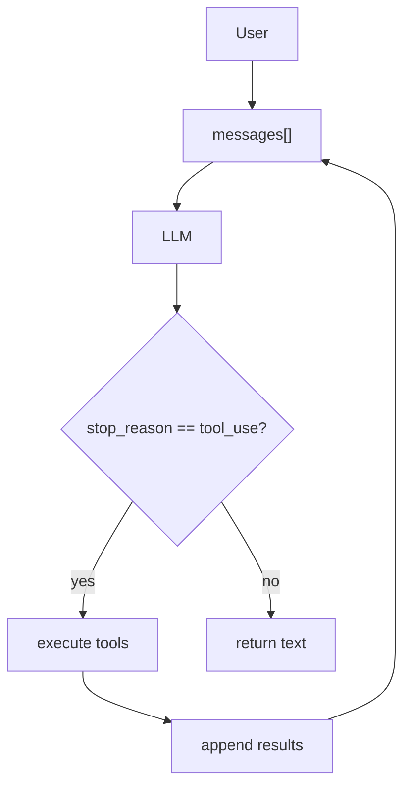

# 核心概念

## Agent、Model、Harness 的关系

这是学习本项目前最重要的概念区分：

```
Agent = Model（模型本身就是智能体）

Harness = Tools + Knowledge + Context + Permissions（工具 + 知识 + 上下文 + 权限）

Product = Agent + Harness（完整产品 = 智能体 + 环境）
```

## 层次图

```
┌─────────────────────────────────────────────────────────┐
│              Claude Code (完整产品)                        │
│  ┌─────────────────────────────────────────────────────┐ │
│  │                Harness (环境/工具层)                   │ │
│  │  ┌─────────┐ ┌──────────┐ ┌──────────┐ ┌─────────┐ │ │
│  │  │  Tools  │ │ Knowledge│ │ Context  │ │Permission│ │ │
│  │  │ bash,   │ │ SKILL.md │ │ compression│ │ sandbox │ │ │
│  │  │ read... │ │ docs     │ │ subagent │ │ approval│ │ │
│  │  └─────────┘ └──────────┘ └──────────┘ └─────────┘ │ │
│  └─────────────────────────────────────────────────────┘ │
│                          +                                │
│  ┌─────────────────────────────────────────────────────┐ │
│  │              Agent = Model (智能体层)                  │ │
│  │           Claude (Anthropic 训练的 LLM)              │ │
│  │   - 决定何时调用工具                                  │ │
│  │   - 决定何时停止                                      │ │
│  │   - 推理和决策                                        │ │
│  └─────────────────────────────────────────────────────┘ │
└─────────────────────────────────────────────────────────┘
```

## 关键区分

| 概念 | 是什么 | 谁构建 | 例子 |
|------|--------|--------|------|
| **Model** | 训练出来的神经网络权重 | Anthropic/OpenAI | Claude, GPT-4 |
| **Agent** | = Model（模型本身就是智能体） | 训练出来 | "Claude 这个模型" |
| **Harness** | 给 Agent 提供的环境/工具 | 应用开发者 | Claude Code 的代码部分 |
| **Product** | Agent + Harness | 产品团队 | Claude Code CLI |

## The Agent Pattern

所有 session 都基于这个核心循环：



## Harness 的组成

```
Harness = Tools + Knowledge + Observation + Action Interfaces + Permissions

    Tools:          file I/O, shell, network, database, browser
    Knowledge:      product docs, domain references, API specs, style guides
    Observation:    git diff, error logs, browser state, sensor data
    Action:         CLI commands, API calls, UI interactions
    Permissions:    sandboxing, approval workflows, trust boundaries
```

## 本项目的定位

> **This repository teaches you to build vehicles.**
>
> 这个项目教你构建车辆（harness），而不是训练司机（agent）。

你学到的技能：
- ✅ 实现工具（给 Agent 手和脚）
- ✅ 管理上下文（给 Agent 清晰的记忆）
- ✅ 控制权限（给 Agent 安全的边界）
- ✅ 持久化任务（给 Agent 长远的目标）

你**不**需要做的：
- ❌ 训练模型
- ❌ 调整模型权重
- ❌ 设计神经网络架构
