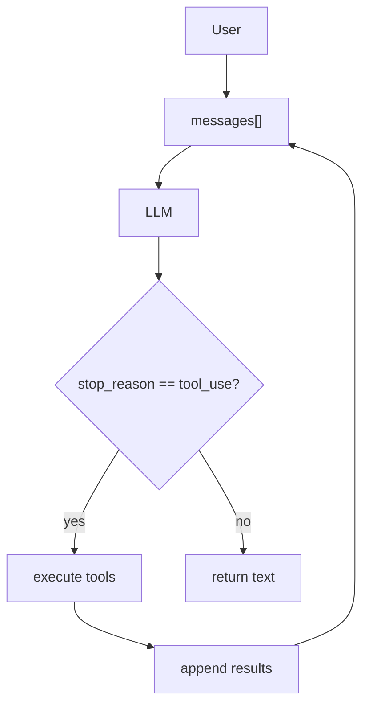

# 总结

## 12 个 Session 回顾

| Session | 主题 | 一句话总结 |
|---------|------|------------|
| [s01](./sessions/s01-the-agent-loop.md) | The Agent Loop | **One loop & Bash is all you need** |
| [s02](./sessions/s02-tool-use.md) | Tool Use | **Adding a tool means adding one handler** |
| [s03](./sessions/s03-todo-write.md) | TodoWrite | **An agent without a plan drifts** |
| [s04](./sessions/s04-subagents.md) | Subagents | **Break big tasks down; each subtask gets a clean context** |
| [s05](./sessions/s05-skills.md) | Skills | **Load knowledge when you need it, not upfront** |
| [s06](./sessions/s06-context-compact.md) | Context Compact | **Context will fill up; you need a way to make room** |
| [s07](./sessions/s07-task-system.md) | Task System | **Break big goals into small tasks, order them, persist to disk** |
| [s08](./sessions/s08-background-tasks.md) | Background Tasks | **Run slow operations in the background; the agent keeps thinking** |
| [s09](./sessions/s09-agent-teams.md) | Agent Teams | **When the task is too big for one, delegate to teammates** |
| [s10](./sessions/s10-team-protocols.md) | Team Protocols | **Teammates need shared communication rules** |
| [s11](./sessions/s11-autonomous-agents.md) | Autonomous Agents | **Teammates scan the board and claim tasks themselves** |
| [s12](./sessions/s12-worktree-isolation.md) | Worktree Isolation | **Each works in its own directory, no interference** |

## 四个阶段

```
Phase 1: THE LOOP                    Phase 2: PLANNING & KNOWLEDGE
==================                   ==============================
s01  The Agent Loop                  s03  TodoWrite
     while + stop_reason                  TodoManager + nag reminder
     |                                    |
     +-> s02  Tool Use                  s04  Subagents
              dispatch map                   fresh messages[]
                                              |
                                         s05  Skills
                                              SKILL.md via tool_result
                                              |
                                         s06  Context Compact
                                              3-layer compression

Phase 3: PERSISTENCE                 Phase 4: TEAMS
==================                   =====================
s07  Tasks                           s09  Agent Teams
     file-based CRUD + deps graph        teammates + JSONL mailboxes
     |                                    |
s08  Background Tasks                s10  Team Protocols
     daemon threads + notify queue       shutdown + plan approval FSM
                                          |
                                     s11  Autonomous Agents
                                          idle cycle + auto-claim
                                     |
                                     s12  Worktree Isolation
                                          task coordination + isolated lanes
```

## 核心公式

```
Agent = Model（模型即智能体）

Harness = Tools + Knowledge + Context + Permissions

Product = Agent + Harness
```

## The Agent Pattern



## 关键洞察

1. **循环不变，工具插件化** -- 从 s01 到 s12，Agent Loop 本身从未改变，变化的是周围的 harness 机制

2. **上下文是稀缺资源** -- s04（Subagent 隔离）、s05（Skills 按需加载）、s06（Context Compact）都在解决同一个问题：保持上下文清洁

3. **持久化是协作的基础** -- s07（Task System）和 s12（Worktree）将状态写入磁盘，使多 Agent 协作成为可能

4. **状态机驱动协作** -- s10-s12 用 FSM 管理队友状态和请求审批，实现自组织的团队

---

> **The model is the agent. The code is the harness. Build great harnesses. The agent will do the rest.**
